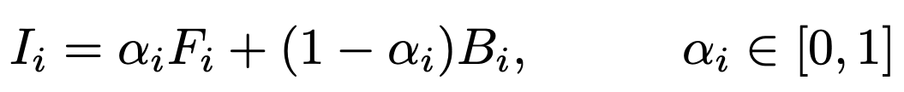
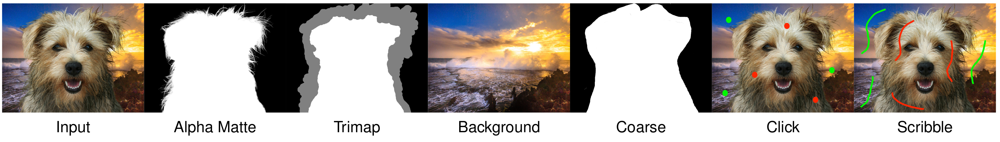
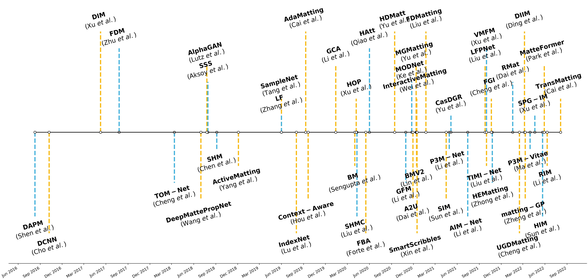
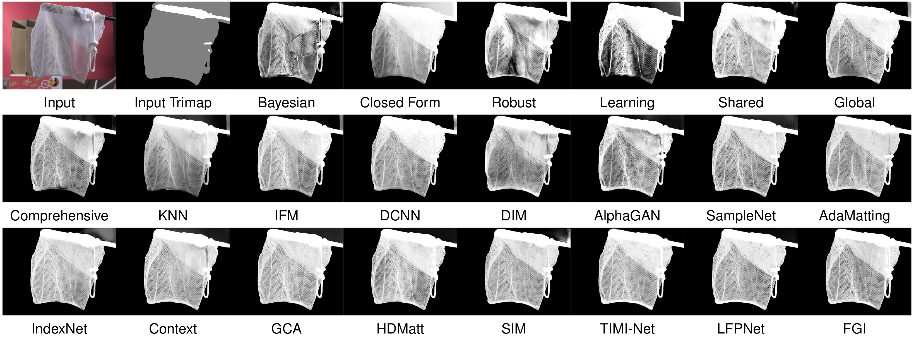
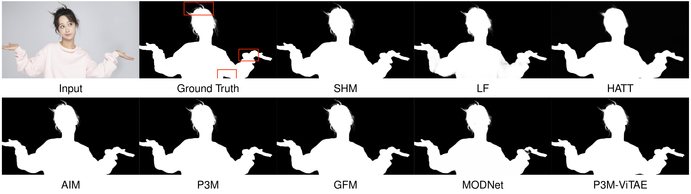

<h1 align="center">Deep Image Matting: A Comprehensive Survey</h1>

<p align="center">
<a href=""></a>
<a href=""></a>
<a href=""></a>
</p>


<h4 align="center">This is the official repository of the paper <a href="">Deep Image Matting: A Comprehensive Survey</a>.</h4>
<h5 align="center"><em>Jizhizi Li, Jing Zhang, and Dacheng Tao<sup>1</sup></em></h5>
<h6 align="center">1 The University of Sydney, Sydney, Australia</h6>


<p align="center">
  <a href="#introduction">Introduction</a> |
  <a href="#preliminary">Preliminary</a> |
  <a href="#image-matting-methods">Methods</a> |
  <a href="#image-matting-datasets">Datasets</a> |
  <a href="#performance-benchmarking">Benchmark</a> |
  <a href="#statement">Statement</a>
</p>


## Introduction

Image matting refers to extracting precise alpha matte from natural images, and it plays a critical role in various downstream applications, such as image editing. The emergence of deep learning has revolutionized the field of image matting and given birth to multiple new techniques, including automatic, interactive, and referring image matting. Here we present a comprehensive review of recent advancements in image matting in the era of deep learning by focusing on two fundamental sub-tasks: auxiliary input-based image matting.

## Preliminary

Image matting, which refers to the precise extraction of the soft matte from foreground objects in arbitrary images, has been extensively studied for several decades. The process can be described mathematically as below, where *I* represents the input image, *F* represents the foreground image, and *B* represents the background image. The opacity of the pixel in the foreground  is denoted by *α<sub>i</sub>*, which ranges from 0 to 1. We also show the typical input image, ground truth alpha matte and various auxiliary inputs such as trimap, background, coarse map, user clicks, scribbles, and a text description in the following figure. The text description for this image can be *the cute smiling brown dog in the middle of the image*.





## Image Matting Methods

We compile a timeline of the developments in deep learning-based image matting methods as follows.




We also list a summary of image matting methods organized according to the year of publication, the publication venue, input modality, automaticity, matting target, architecture, availability of the code (with the link). Please note that the list of papers is chronologically ordered.


<table>
    <thead>
        <tr>
            <th>Year</th>
            <th>Method</th>
            <th>Pub.</th>
            <th>Input</th>
            <th>Auto.</th>
            <th>Target</th>
            <th>Arch.</th>
            <th>Code</th>
        </tr>
    </thead>
    <tbody align='center'>        
        <tr>
            <th rowspan="2">2016</th>
            <td><a href="https://link.springer.com/chapter/10.1007/978-3-319-46448-0_6">Deep automatic portrait matting (DAPM)</a></td>
            <td>ECCV</td>
            <td>RGB</td>
            <td>&check;</td>
            <td>human<a href="https://jiaya.me/projects/automatting/index.html"></td>
            <td>Sequential two-step CNN</td>
            <td>-</td>
        </tr>
        <tr>
            <td><a href="https://link.springer.com/chapter/10.1007/978-3-319-46475-6_39">Natural image matting using deep convolutional neural networks (DCNN)</a></td>
            <td>ECCV</td>
            <td>RGB-Coarse</td>
            <td>&cross;</td>
            <td>object</td>
            <td>One-stage CNN</td>
            <td>-</td>
        </tr>
        <tr>
            <th rowspan="2">2017</th>
            <td><a href="https://openaccess.thecvf.com/content_cvpr_2017/html/Xu_Deep_Image_Matting_CVPR_2017_paper.html">Deep image matting (DIM)</a></td>
            <td>CVPR</td>
            <td>RGB-Trimap</td>
            <td>&cross;</td>
            <td>object<a href="https://sites.google.com/view/deepimagematting"></td>
            <td>One-stage CNN+Refine</td>
            <td><a href="https://github.com/foamliu/Deep-Image-Matting-PyTorch">Github[U]</a></td>
        </tr>
        <tr>
            <td><a href="https://dl.acm.org/doi/10.1145/3123266.3123286">Fast deep matting for portrait animation on mobile phone (FDM)</a></td>
            <td>MM</td>
            <td>RGB</td>
            <td>&check;</td>
            <td>human</td>
            <td>Sequantial two-step CNN</td>
            <td>-</td>
        </tr>
        <tr>
            <th rowspan="6">2018</th>
            <td><a href="https://openaccess.thecvf.com/content_cvpr_2018/html/Chen_TOM-Net_Learning_Transparent_CVPR_2018_paper.html">Tom-Net: Learning transparent object matting from a single image (TOM-Net)</a></td>
            <td>CVPR</td>
            <td>RGB</td>
            <td>&check;</td>
            <td>transparent<a href="https://guanyingc.github.io/TOM-Net/"></td>
            <td>Sequential two-step CNN+Refine</td>
            <td><a href="https://github.com/guanyingc/TOM-Net">Github</a></td>
        </tr>
        <tr>
            <td><a href="https://www.ijcai.org/proceedings/2018/0139">Deep propagation based image matting (DMPN)</a></td>
            <td>IJCAI</td>
            <td>RGB-Trimap</td>
            <td>&cross;</td>
            <td>object</td>
            <td>One-stage CNN</td>
            <td>-</td>
        </tr>
        <tr>
            <td><a href="http://bmvc2018.org/contents/papers/0915.pdf">Alphagan: Generative adversarial networks for natural image matting (AlphaGAN)</a></td>
            <td>BMVC</td>
            <td>RGB-Trimap</td>
            <td>&cross;</td>
            <td>object</td>
            <td>One-stage GAN</td>
            <td><a href="https://github.com/CDOTAD/AlphaGAN-Matting">Github[U]</a></td>
        </tr>
        <tr>
            <td><a href="https://dl.acm.org/doi/10.1145/3197517.3201275">Semantic soft segmentation (SSS)</a></td>
            <td>TOG</td>
            <td>RGB</td>
            <td>&check;</td>
            <td>object</td>
            <td>Sequential two-stage</td>
            <td><a href="https://github.com/yaksoy/SemanticSoftSegmentation">Github</a></td>
        </tr>
        <tr>
            <td><a href="https://dl.acm.org/doi/pdf/10.1145/3240508.3240610">Semantic human matting (SHM)</a></td>
            <td>MM</td>
            <td>RGB</td>
            <td>&check;</td>
            <td>human</td>
            <td>Sequential two-step CNN</td>
            <td><a href="https://github.com/lizhengwei1992/Semantic_Human_Matting">Github[U]</a></td>
        </tr>
        <tr>
            <td><a href="https://papers.nips.cc/paper_files/paper/2018/hash/653ac11ca60b3e021a8c609c7198acfc-Abstract.html">Active matting (ActiveMatting)</a></td>
            <td>NeurIPS</td>
            <td>RGB-Click</td>
            <td>&cross;</td>
            <td>object</td>
            <td>One-stage RNN</td>
            <td>-</td>
        </tr>
        <tr>
            <th rowspan="5">2019</th>
            <td><a href="https://openaccess.thecvf.com/content_CVPR_2019/html/Zhang_A_Late_Fusion_CNN_for_Digital_Matting_CVPR_2019_paper.html">A late fusion cnn for digital matting (LF)</a></td>
            <td>CVPR</td>
            <td>RGB</td>
            <td>&check;</td>
            <td>object<a href="https://github.com/yunkezhang/FusionMatting"></td>
            <td>Sequential two-stage CNN</td>
            <td><a href="https://github.com/yunkezhang/FusionMatting">Github</td>
        </tr>
        <tr>
            <td><a href="https://openaccess.thecvf.com/content_CVPR_2019/html/Tang_Learning-Based_Sampling_for_Natural_Image_Matting_CVPR_2019_paper.html">Learning-based sampling for natural image matting (SampleNet)</a></td>
            <td>CVPR</td>
            <td>RGB-Trimap</td>
            <td>&cross;</td>
            <td>object</td>
            <td>Parallel three-stream CNN</td>
            <td>-</td>
        </tr>
        <tr>
            <td><a href="https://openaccess.thecvf.com/content_ICCV_2019/html/Lu_Indices_Matter_Learning_to_Index_for_Deep_Image_Matting_ICCV_2019_paper.html">Indices matter: Learning to index for deep image matting (IndexNet)</a></td>
            <td>ICCV</td>
            <td>RGB-Trimap</td>
            <td>&cross;</td>
            <td>object</td>
            <td>One-stage CNN</td>
            <td><a href="https://github.com/poppinace/indexnet_matting">Github</a></td>
        </tr>
        <tr>
            <td><a href="https://openaccess.thecvf.com/content_ICCV_2019/html/Cai_Disentangled_Image_Matting_ICCV_2019_paper.html">Disentangled image matting (AdaMatting)</a></td>
            <td>ICCV</td>
            <td>RGB-Trimap</td>
            <td>&cross;</td>
            <td>object</td>
            <td>Parallel two-stream CNN+refine</td>
            <td>-</td>
        </tr>
        <tr>
            <td><a href="https://openaccess.thecvf.com/content_ICCV_2019/html/Hou_Context-Aware_Image_Matting_for_Simultaneous_Foreground_and_Alpha_Estimation_ICCV_2019_paper.html">Context-aware image matting for simultaneous foreground and alpha estimation (Context-Aware)</a></td>
            <td>ICCV</td>
            <td>RGB-Trimap</td>
            <td>&cross;</td>
            <td>object</td>
            <td>Two-stream CNN</td>
            <td><a href="https://github.com/hqqxyy/Context-Aware-Matting">Github</a></td>
        </tr>
        <tr>
            <th rowspan="14">2020</th>
            <td><a href="https://ojs.aaai.org/index.php/AAAI/article/view/6809">Natural image matting via guided contextual attention (GCA)</a></td>
            <td>AAAI</td>
            <td>RGB-Trimap</td>
            <td>&cross;</td>
            <td>object</td>
            <td>One-stage CNN</td>
            <td><a href="https://github.com/Yaoyi-Li/GCA-Matting">Github</a></td>
        </tr>
        <tr>
            <td><a href="https://openaccess.thecvf.com/content_CVPR_2020/html/Sengupta_Background_Matting_The_World_Is_Your_Green_Screen_CVPR_2020_paper.html">Background matting: The world is your green screen (BM)</a></td>
            <td>CVPR</td>
            <td>RGB-Background</td>
            <td>&cross;</td>
            <td>human</td>
            <td>Parallel four-stream CNN</td>
            <td><a href="https://github.com/senguptaumd/Background-Matting">Github</a></td>
        </tr>
        <tr>
            <td><a href="https://arxiv.org/abs/2004.03249">Hierarchical opacity propa- gation for image matting (HOP)</a></td>
            <td>arXiv</td>
            <td>RGB-Trimap</td>
            <td>&cross;</td>
            <td>object</td>
            <td>Parallel two-stream CNN</td>
            <td><a href="https://github.com/Yaoyi-Li/HOP-Matting">Github</a></td>
        </tr>
        <tr>
            <td><a href="https://openaccess.thecvf.com/content_CVPR_2020/html/Liu_Boosting_Semantic_Human_Matting_With_Coarse_Annotations_CVPR_2020_paper.html">Boosting semantic human matting with coarse annotations (SHMC)</a></td>
            <td>CVPR</td>
            <td>RGB</td>
            <td>&check;</td>
            <td>human</td>
            <td>Sequential two-stage CNN</td>
            <td>-</td>
        </tr>
        <tr>
            <td><a href="https://arxiv.org/abs/2003.07711">F, b, alpha matting (FBA)</a></td>
            <td>arXiv</td>
            <td>RGB-Trimap</td>
            <td>&cross;</td>
            <td>object</td>
            <td>One-stage CNN</td>
            <td><a href="https://github.com/MarcoForte/FBA_Matting">Github</a></a></td>
        </tr>  
        <tr>
            <td><a href="https://openaccess.thecvf.com/content_CVPR_2020/html/Qiao_Attention-Guided_Hierarchical_Structure_Aggregation_for_Image_Matting_CVPR_2020_paper.html">Attention-guided hierarchical structure aggregation for image matting (HAtt)</a></td>
            <td>CVPR</td>
            <td>RGB</td>
            <td>&check;</td>
            <td>object<a href="https://github.com/yuhaoliu7456/CVPR2020-HAttMatting"></td>
            <td>One-stage CNN</td>
            <td>-</td>
        </tr>
        <tr>
            <td><a href="https://ojs.aaai.org/index.php/AAAI/article/view/16432">High-resolution deep image matting (HDMatt)</a></td>
            <td>AAAI</td>
            <td>RGB-Trimap</td>
            <td>&cross;</td>
            <td>object</td>
            <td>Parallel two-stream CNN</td>
            <td>-</td>
        </tr>
        <tr>
            <td><a href="https://link.springer.com/article/10.1007/s11263-021-01541-0">Bridging composite and real: towards end-to-end deep image matting (GFM)</a></td>
            <td>IJCV</td>
            <td>RGB</td>
            <td>&check;</td>
            <td>human, animal<a href="https://github.com/JizhiziLi/gfm"></td>
            <td>Parallel two-stream CNN</td>
            <td><a href="https://github.com/JizhiziLi/gfm">Github</a></td>
        </tr>
        <tr>
            <td><a href="https://ojs.aaai.org/index.php/AAAI/article/view/19999">Modnet: Real-time trimap-free portrait matting via objective decomposition (MODNet)</a></td>
            <td>AAAI</td>
            <td>RGB</td>
            <td>&check;</td>
            <td>human<a href="https://github.com/ZHKKKe/MODNet"></td>
            <td>Parallel two-stream CNN</td>
            <td><a href="https://github.com/ZHKKKe/MODNet">Github</a></td>
        </tr>
        <tr>
            <td><a href="https://openaccess.thecvf.com/content/CVPR2021/html/Dai_Learning_Affinity-Aware_Upsampling_for_Deep_Image_Matting_CVPR_2021_paper.html">Learning affinity-aware upsampling for deep image matting（A2U）</a></td>
            <td>CVPR</td>
            <td>RGB-Trimap</td>
            <td>&cross;</td>
            <td>object</td>
            <td>One-stage CNN</td>
            <td><a href="https://github.com/dongdong93/a2u_matting">Github</a></td>
        </tr>
        <tr>
            <td><a href="https://openaccess.thecvf.com/content/CVPR2021/html/Yu_Mask_Guided_Matting_via_Progressive_Refinement_Network_CVPR_2021_paper.html">Mask guided matting via progressive refinement network (MGMatting)</a></td>
            <td>CVPR</td>
            <td>RGB-Coarse</td>
            <td>&cross;</td>
            <td>human<a href="https://github.com/yucornetto/MGMatting"></td>
            <td>One-stage CNN</td>
            <td><a href="https://github.com/yucornetto/MGMatting">Github</a></td>
        </tr>
        <tr>
            <td><a href="https://openaccess.thecvf.com/content/CVPR2021/html/Wei_Improved_Image_Matting_via_Real-Time_User_Clicks_and_Uncertainty_Estimation_CVPR_2021_paper.html">Improved image matting via real-time user clicks and uncertainty estimation (InteractiveMatting)</a></td>
            <td>CVPR</td>
            <td>RGB-Click</td>
            <td>&cross;</td>
            <td>object</td>
            <td>Parallel two-stream CNN</td>
            <td>-</td>
        </tr>
        <tr>
            <td><a href="https://dl.acm.org/doi/10.1145/3408323">Smart scribbles for image matting (SmartScribbles)</a></td>
            <td>TOMM</td>
            <td>RGB-Scribble</td>
            <td>&cross;</td>
            <td>object</td>
            <td>One-stage CNN</td>
            <td>-</td>
        </tr>
        <tr>
            <td><a href="https://openaccess.thecvf.com/content/CVPR2021/html/Lin_Real-Time_High-Resolution_Background_Matting_CVPR_2021_paper.html">Real-Time High-Resolution Background Matting (BMV2)</a></td>
            <td>CVPR</td>
            <td>RGB-Background</td>
            <td>&cross;</td>
            <td>human<a href="https://grail.cs.washington.edu/projects/background-matting-v2/#/datasets"></td>
            <td>One-stage CNN+refine</td>
            <td><a href="https://github.com/PeterL1n/BackgroundMattingV2">Github</a></td>
        </tr>
        <tr>
            <th rowspan="10">2021</th>
            <td><a href="https://openaccess.thecvf.com/content/WACV2021/html/Liu_Towards_Enhancing_Fine-Grained_Details_for_Image_Matting_WACV_2021_paper.html">Towards enhancing fine-grained details for image matting (FDMatting)</a></td>
            <td>WACV</td>
            <td>RGB-Trimap</td>
            <td>&cross;</td>
            <td>object</td>
            <td>Two-stream CNN</td>
            <td>-</td>
        </tr>     
        <tr>
            <td><a href="https://openaccess.thecvf.com/content/CVPR2021/html/Sun_Semantic_Image_Matting_CVPR_2021_paper.html">Semantic image matting (SIM)</a></td>
            <td>CVPR</td>
            <td>RGB-Trimap</td>
            <td>&cross;</td>
            <td>object<a href="https://github.com/nowsyn/SIM"></td>
            <td>One-stage CNN</td>
            <td><a href="https://github.com/nowsyn/SIM">Github</a></td>
        </tr>
        <tr>
            <td><a href="https://dl.acm.org/doi/10.1145/3474085.3475512">Privacy-preserving portrait matting (P3M-Net)</a></td>
            <td>MM</td>
            <td>RGB</td>
            <td>&check;</td>
            <td>human<a href="https://github.com/JizhiziLi/P3M"></td>
            <td>Parallel two-stream CNN</td>
            <td><a href="https://github.com/jizhiziLi/p3m">Github</a></td>
        </tr>
        <tr>
            <td><a href="https://openaccess.thecvf.com/content/ICCV2021/html/Yu_Cascade_Image_Matting_With_Deformable_Graph_Refinement_ICCV_2021_paper.html">Cascade image matting with deformable graph refinement (CasDGR)</a></td>
            <td>ICCV</td>
            <td>RGB</td>
            <td>&check;</td>
            <td>object</td>
            <td>Parallel two-stream CNN</td>
            <td>-</td>
        </tr>
        <tr>
            <td><a href="https://www.ijcai.org/proceedings/2021/111">Deep Automatic Natural Image Matting (AIM-Net)</a></td>
            <td>IJCAI</td>
            <td>RGB</td>
            <td>&check;</td>
            <td>object<a href="https://github.com/JizhiziLi/aim"></td>
            <td>Parallel two-stream CNN</td>
            <td><a href="https://github.com/JizhiziLi/aim">Github</a></td>
        </tr>
        <tr>
            <td><a href="https://dl.acm.org/doi/10.1145/3474085.3475203">Long-range feature propagating for natural image matting (LFPNet)</a></td>
            <td>MM</td>
            <td>RGB-Trimap</td>
            <td>&cross;</td>
            <td>object</td>
            <td>Parallel two-stream CNN</td>
            <td><a href="https://github.com/QLYoo/LFPNet">Github</a></td>
        </tr>
        <tr>
            <td><a href="https://openaccess.thecvf.com/content/ICCV2021/html/Xu_Virtual_Multi-Modality_Self-Supervised_Foreground_Matting_for_Human-Object_Interaction_ICCV_2021_paper.html">Virtual Multi-Modality Self-Supervised Foreground Matting for Human-Object Interaction (VMFM)</a></td>
            <td>ICCV</td>
            <td>RGB</td>
            <td>&check;</td>
            <td>human-object</td>
            <td>Sequential two-stage CNN</td>
            <td>-</td>
        </tr>  
        <tr>
            <td><a href="https://openaccess.thecvf.com/content/ICCV2021/html/Liu_Tripartite_Information_Mining_and_Integration_for_Image_Matting_ICCV_2021_paper.html">Tripartite Information Mining and Integration for Image Matting (TIMI-Net)</a></td>
            <td>ICCV</td>
            <td>RGB-Trimap</td>
            <td>&cross;</td>
            <td>object<a href="https://github.com/kelisiya/TIMI-Net"></td>
            <td>Parallel three-stream CNN</td>
            <td><a href="https://github.com/kelisiya/TIMI-Net">Github</a></td>
        </tr>
        <tr>
            <td><a href="https://www.bmvc2021-virtualconference.com/assets/papers/0697.pdf">Deep Image Matting with Flexible Guidance Input (FGI)</a></td>
            <td>BMVC</td>
            <td>RGB-Flexible</td>
            <td>&cross;</td>
            <td>object</td>
            <td>One-stage CNN</td>
            <td><a href="https://github.com/Charch-630/FGI-Matting">Github</a></td>
        </tr>
        <tr>
            <td><a href="https://www.bmvc2021-virtualconference.com/assets/papers/1642.pdf">Highly efficient natural image matting (HEMatting)</a></td>
            <td>BMVC</td>
            <td>RGB</td>
            <td>&check;</td>
            <td>object</td>
            <td>Sequential two-stage CNN</td>
            <td>-</td>
        </tr>   
        <tr>
            <th rowspan="10">2022</th>
            <td><a href="https://openaccess.thecvf.com/content/CVPR2022/html/Dai_Boosting_Robustness_of_Image_Matting_With_Context_Assembling_and_Strong_CVPR_2022_paper.html">Boosting Robustness of Image Matting With Context Assembling and Strong Data Augmentation (Rmat)</a></td>
            <td>CVPR</td>
            <td>RGB-Trimap</td>
            <td>&cross;</td>
            <td>object</td>
            <td>Parallel two-stream CNN/Transformer</td>
            <td>-</td>
        </tr>     
        <tr>
            <td><a href="https://ieeexplore.ieee.org/document/9730784">Deep interactive image matting with feature propagation (DIIM)</a></td>
            <td>TIP</td>
            <td>RGB-Click</td>
            <td>&cross;</td>
            <td>object</td>
            <td>One-stage CNN</td>
            <td>-</td>
        </tr>
        <tr>
            <td><a href="https://ieeexplore.ieee.org/document/9714230">User-Guided Deep Human Image Matting Using Arbitrary Trimaps (UGDMatting)</a></td>
            <td>TIP</td>
            <td>RGB-Flexible</td>
            <td>&cross;</td>
            <td>human</td>
            <td>Parallel two-stream CNN</td>
            <td>-</td>
        </tr>
        <tr>
            <td><a href="https://ieeexplore.ieee.org/document/9733204">Image matting with deep gaussian process (matting-GP)</a></td>
            <td>TNNLS</td>
            <td>RGB-Trimap</td>
            <td>&cross;</td>
            <td>object</td>
            <td>One-stage CNN</td>
            <td>-</td>
        </tr>
        <tr>
            <td><a href="https://arxiv.org/abs/2203.16828">Rethinking portrait matting with privacy preserving (P3M-ViTAE)</a></td>
            <td>IJCV</td>
            <td>RGB</td>
            <td>&check;</td>
            <td>human<a href="https://github.com/ViTAE-Transformer/P3M-Net"></td>
            <td>Parallel two stream CNN/Transformer</td>
            <td><a href="https://github.com/ViTAE-Transformer/P3M-Net">Github</a></td>
        </tr>
        <tr>
            <td><a href="https://dl.acm.org/doi/10.1145/3503161.3548036">Situational Perception Guided Image Matting (SPG-IM)</a></td>
            <td>MM</td>
            <td>RGB</td>
            <td>&check;</td>
            <td>object</td>
            <td>Sequential two-stage CNN</td>
            <td>-</td>
        </tr>
        <tr>
            <td><a href="https://openaccess.thecvf.com/content/CVPR2022/html/Sun_Human_Instance_Matting_via_Mutual_Guidance_and_Multi-Instance_Refinement_CVPR_2022_paper.html">Human instance matting via mutual guidance and multi-instance refinement (HIM)</a></td>
            <td>CVPR</td>
            <td>RGB</td>
            <td>&check;</td>
            <td>human<a href="https://github.com/nowsyn/InstMatt"></td>
            <td>Sequential two-stage CNN</td>
            <td><a href="https://github.com/nowsyn/InstMatt">Github</a></td>
        </tr>  
        <tr>
            <td><a href="https://openaccess.thecvf.com/content/CVPR2022/html/Park_MatteFormer_Transformer-Based_Image_Matting_via_Prior-Tokens_CVPR_2022_paper.html">MatteFormer: Transformer-Based Image Matting via Prior-Tokens (MatteFormer)</a></td>
            <td>CVPR</td>
            <td>RGB-Trimap</td>
            <td>&cross;</td>
            <td>object</td>
            <td>One-stage CNN</td>
            <td><a href="https://github.com/webtoon/matteformer">Github</a></td>
        </tr>
        <tr>
            <td><a href="https://arxiv.org/abs/2206.05149">Referring image matting (RIM)</a></td>
            <td>CVPR</td>
            <td>RGB-Language</td>
            <td>&cross;</td>
            <td>object<a href="https://github.com/JizhiziLi/RIM"></td>
            <td>One-stage CNN</td>
            <td><a href="http://github.com/jizhiziLi/rim">Github</a></td>
        </tr>
        <tr>
            <td><a href="https://dl.acm.org/doi/abs/10.1007/978-3-031-19818-2_15">TransMatting: Enhancing Transparent Objects Matting with Transformers (TransMatting)</a></td>
            <td>ECCV</td>
            <td>RGB-Trimap</td>
            <td>&cross;</td>
            <td>transparent<a href="https://github.com/AceCHQ/TransMatting"></td>
            <td>One-stage CNN/Transformer</td>
            <td><a href="https://github.com/AceCHQ/TransMatting">Github</a></td>
        </tr>               
    </tbody>
</table>

## Image Matting Datasets

We list a summary image matting datasets, categorized as the synthetic image-based benchmark, natural image-based benchmark, and test sets. The datasets are ordered based on their release date and are described in terms of publication venue, naturalness, matting target, resolution, number of training and test samples, and availability (along with their links). It should be noted that the size of the datasets is calculated based on the number of distinguished foregrounds, except for TOM and RefMatte, which have pre-defined composite rules.

|Name|Pub.|Natural|Target|Resolution|#Train|#Test|Publicity|
|:----:|:----:|:----:|:----:|:----:|:----:|:----:|:----:|
|[DIM-481](https://openaccess.thecvf.com/content_cvpr_2017/html/Xu_Deep_Image_Matting_CVPR_2017_paper.html)|CVPR'17|&cross;|object|1298×1083|431|50|[Link](https://sites.google.com/view/deepimagematting)|
|[TOM](https://openaccess.thecvf.com/content_cvpr_2018/html/Chen_TOM-Net_Learning_Transparent_CVPR_2018_paper.html)|CVPR'18|&cross;|transparent|-|178,000|876|[Link](https://guanyingc.github.io/TOM-Net/)|
|[LF-257](https://openaccess.thecvf.com/content_CVPR_2019/html/Zhang_A_Late_Fusion_CNN_for_Digital_Matting_CVPR_2019_paper.html)|CVPR'19|&cross;|human|553×756|228|29|[Link](https://github.com/yunkezhang/FusionMatting)|
|[HATT-646](https://openaccess.thecvf.com/content_CVPR_2020/html/Qiao_Attention-Guided_Hierarchical_Structure_Aggregation_for_Image_Matting_CVPR_2020_paper.html)|CVPR'20|&cross;|object|1573×1731|596|60|[Link](https://github.com/yuhaoliu7456/CVPR2020-HAttMatting)|
|[PhotoMatte13k](https://openaccess.thecvf.com/content/CVPR2021/html/Lin_Real-Time_High-Resolution_Background_Matting_CVPR_2021_paper.html)|CVPR'20|&cross;|human|-|13665|-|-|
|[SIM](https://openaccess.thecvf.com/content/CVPR2021/html/Sun_Semantic_Image_Matting_CVPR_2021_paper.html)|CVPR'21|&cross;|object|2194×1950|348|50|[Link](https://github.com/nowsyn/SIM)|
|[Human-2k](https://openaccess.thecvf.com/content/ICCV2021/html/Liu_Tripartite_Information_Mining_and_Integration_for_Image_Matting_ICCV_2021_paper.html)|ICCV'21|&cross;|human|2112×2075|2000|100|[Link](https://github.com/kelisiya/TIMI-Net)|
|[Trans-460](https://dl.acm.org/doi/abs/10.1007/978-3-031-19818-2_15)|ECCV'22|&cross;|transparent|3766×3820|410|50|[Link](https://github.com/AceCHQ/TransMatting)|
|[HIM2k](https://openaccess.thecvf.com/content/CVPR2022/html/Sun_Human_Instance_Matting_via_Mutual_Guidance_and_Multi-Instance_Refinement_CVPR_2022_paper.html)|CVPR'22|&cross;|human|1823×1424|1500|500|[Link](https://github.com/nowsyn/InstMatt)|
|[RefMatte](https://arxiv.org/abs/2206.05149)|CVPR'23|&cross;|object|1543×1162|45000|2500|[Link](https://github.com/JizhiziLi/RIM)|
|[AlphaMatting](https://ieeexplore.ieee.org/document/5206503)|CVPR'09|&check;|object|3056×2340|27|8|[Link](http://alphamatting.com/)|
|[DAPM-2k](https://link.springer.com/chapter/10.1007/978-3-319-46448-0_6)|ECCV'16|&check;|human|600×800|1700|300|[Link](https://jiaya.me/projects/automatting/index.html)|
|[SHM-35k](https://dl.acm.org/doi/pdf/10.1145/3240508.3240610)|MM'18|&check;|human|-|52511|1400|-|
|[SHMC-10k](https://arxiv.org/abs/2004.04955)|CVPR'20|&check;|human|-|9324|125|-|
|[P3M-10k](https://dl.acm.org/doi/10.1145/3474085.3475512)|MM'21|&check;|human|1349×1321|9421|1000|[Link](https://github.com/JizhiziLi/P3M)|
|[AM-2k](https://link.springer.com/article/10.1007/s11263-021-01541-0)|IJCV'22|&check;|animal|1471×1195|1800|200|[Link](https://github.com/jizhiziLi/gfm)|
|[Multi-Object-1k](https://dl.acm.org/doi/10.1145/3503161.3548036)|MM'22|&check;|human-object|-|1000|200|-|
|[UGD-12k](https://ieeexplore.ieee.org/document/9714230/)|TIP'22|&check;|human|356×317|12066|700|-|
|[PhotoMatte85](https://openaccess.thecvf.com/content/CVPR2021/html/Lin_Real-Time_High-Resolution_Background_Matting_CVPR_2021_paper.html)|CVPR'20|&cross;|human|2304×3456|-|85|[Link](https://grail.cs.washington.edu/projects/background-matting-v2/#/datasets)|
|[AIM-500](https://www.ijcai.org/proceedings/2021/111)|IJCAI'21|&check;|object|1397×1260|-|500|[Link](https://github.com/jizhiziLi/aim)|
|[RWP-636](https://openaccess.thecvf.com/content/CVPR2021/html/Yu_Mask_Guided_Matting_via_Progressive_Refinement_Network_CVPR_2021_paper.html)|CVPR'21|&check;|human|1038×1327|-|636|[Link](https://github.com/yucornetto/MGMatting)|
|[PPM-100](https://ojs.aaai.org/index.php/AAAI/article/view/19999)|AAAI'22|&check;|human|2997×2875|-|100|[Link](https://github.com/ZHKKKe/MODNet)|


## Performance Benchmarking
We provide a comprehensive evaluation of representative matting methods in the paper. Here, we present some subjective results of auxiliary-based matting methods on [alphamatting.com](http://alphamatting.com/) and automatic matting methods on [P3M-500-NP](https://github.com/jizhiziLi/p3m#ppt-setting-and-p3m-10k-dataset).





## Statement

If you are interested in our work, please consider citing the following:
```
@article{li2023deep,
  title={Deep Image Matting: A Comprehensive Survey},
  author={Jizhizi Li and Jing Zhang and Dacheng Tao},
  journal={ArXiv},
  year={2023}
}
```

This project is under the MIT license. For further questions, please contact <strong><i>Jizhizi Li</i></strong> at [jili8515@uni.sydney.edu.au](mailto:jili8515@uni.sydney.edu.au).


## Relevant Projects

[1] <strong>Deep Automatic Natural Image Matting, IJCAI, 2021</strong> | [Paper](https://www.ijcai.org/proceedings/2021/0111.pdf) | [Github](https://github.com/JizhiziLi/AIM)
<br><em>&ensp; &ensp; &ensp;Jizhizi Li, Jing Zhang, and Dacheng Tao</em>

[2] <strong>Privacy-preserving Portrait Matting, ACM MM, 2021</strong> | [Paper](https://dl.acm.org/doi/10.1145/3474085.3475512) | [Github](https://github.com/JizhiziLi/P3M)
<br><em>&ensp; &ensp; &ensp;Jizhizi Li<sup>&#8727;</sup>, Sihan Ma<sup>&#8727;</sup>, Jing Zhang, Dacheng Tao</em>

[3] <strong>Bridging Composite and Real: Towards End-to-end Deep Image Matting, IJCV, 2022 </strong> | [Paper](https://link.springer.com/article/10.1007/s11263-021-01541-0) | [Github](https://github.com/JizhiziLi/GFM)
<br><em>&ensp; &ensp; &ensp;Jizhizi Li<sup>&#8727;</sup>, Jing Zhang<sup>&#8727;</sup>, Stephen J. Maybank, Dacheng Tao</em>


[4] <strong>Referring Image Matting, CVPR, 2023</strong> | [Paper](https://arxiv.org/pdf/2206.05149.pdf) | [Github](https://github.com/JizhiziLi/RIM)
<br><em>&ensp; &ensp; &ensp;Jizhizi Li, Jing Zhang, and Dacheng Tao</em>


[5] <strong>Rethinking Portrait Matting with Privacy Preserving, IJCV, 2023</strong> | [Paper](https://arxiv.org/pdf/2203.16828.pdf) | [Github](https://github.com/ViTAE-Transformer/P3M-Net)
<br><em>&ensp; &ensp; &ensp;Sihan Ma<sup>&#8727;</sup>, Jizhizi Li<sup>&#8727;</sup>, Jing Zhang, He Zhang, Dacheng Tao</em>
